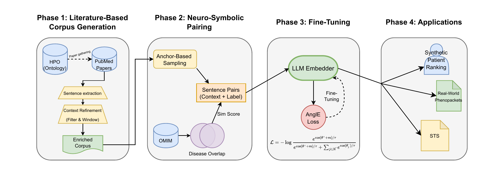

# Neuro-Symbolic Alignment for Biomedical Embeddings

**Structure-Aware Contrastive Learning for Biomedical Embeddings: Bridging the Gap between HPO and Clinical Literature**

> Accepted at IJCAI-ECAI 2026 — AI and Health Track (forthcoming)

## Abstract

Large Language Models (LLMs) are extensively used in biomedical text processing but often fail to capture the complex functional relationships encoded in expert knowledge graphs like the Human Phenotype Ontology (HPO). This "semantic gap" limits their utility in precision medicine tasks such as rare disease diagnosis. We propose a **Neuro-Symbolic Alignment Framework** that bridges this separation by integrating literature-mined phenotype descriptions with ontological structure. Our approach: (1) augments phenotype representations with text fragments mined from PubMed, overcoming data scarcity; (2) defines a novel "Disease-Overlap" similarity measure based on shared disease annotations rather than graph distance; (3) optimizes the embedding space using AnglE Loss with anchor-based hard sampling. Evaluations show our fine-tuned PubMedBERT achieves a **4× improvement** in Top-1 accuracy over baselines on real-world Phenopacket patient retrieval, and doubles GSC+ retrieval performance.

---

## Installation

```bash
pip install -r requirements.txt
```

> **Note:** SpaCy's SciSpaCy model (`en_core_sci_sm`) is required for biomedical sentence tokenisation:
> ```bash
> pip install https://s3-us-west-2.amazonaws.com/ai2-s2-scispacy/releases/v0.5.3/en_core_sci_sm-0.5.3.tar.gz
> ```

---

## Configuration

This project uses the NCBI Entrez API for PubMed queries. Set these environment variables:

```bash
export ENTREZ_EMAIL="your-email@example.com"       # Required — identifies your requests to NCBI
export ENTREZ_API_KEY="your_ncbi_api_key"          # Optional — increases rate limit from ~3 to ~10 req/s
```

Without an API key, the rate limiter defaults to 3 requests per second. Obtain an API key from [NCBI](https://www.ncbi.nlm.nih.gov/account/settings/).

Additional optional environment variables:

| Variable                    | Default         | Description                              |
|-----------------------------|-----------------|------------------------------------------|
| `MAX_THREADS`               | `12`            | Number of parallel download threads      |
| `BATCH_SIZE`                | `100`           | Download batch size                      |
| `MAX_SENTENCES_PER_TERM`    | *(unlimited)*   | Cap sentences per HPO term               |
| `DATA_DIR`                  | `data`          | Root directory for all data files        |
| `PARQUET_COMPRESSION`       | `zstd`          | Compression codec for Parquet files      |

---

## Dependencies

All Python dependencies are listed in [`requirements.txt`](requirements.txt). Key libraries:

| Category               | Packages                                                       |
|------------------------|----------------------------------------------------------------|
| Core ML                | `torch`, `sentence-transformers`, `transformers`, `peft`       |
| HPO Ontology           | `pyhpo`                                                        |
| Data handling          | `pandas`, `pyarrow`, `numpy`, `scipy`                          |
| ML / optimisation      | `scikit-learn`, `optuna`                                       |
| PubMed / NCBI API      | `biopython`                                                    |
| NLP / tokenisation     | `spacy`, `nltk`, SciSpaCy (`en_core_sci_sm`)                   |
| Visualisation          | `matplotlib`, `umap-learn`                                     |
| Utilities              | `tqdm`, `jsonlines`, `datasets`, `pyyaml`                      |

---

## Pipeline Overview



The framework consists of four stages: **Literature-Based Corpus Generation**, where HPO terms are enriched with diverse linguistic contexts mined from PubMed using dynamic windowing and negation filtering; **Neuro-Symbolic Pairing**, where Anchor-Based Sampling creates training pairs supervised by our Disease-Overlap Similarity metric; **Model Fine-Tuning**, where a bi-encoder is optimized using AnglE Loss with partial freezing; and **Applications & Evaluation** across multiple downstream tasks.

---

## Phase 1: Literature-Based Corpus Generation

Mine PubMed for sentences mentioning HPO terms, applying quality filters described in the paper (negation filtering via dependency parsing, enumeration list removal, dynamic context windowing of ±25 words around target terms).

```bash
# Full pipeline: search PMC, download XML, extract sentences, consolidate to Parquet
python phase1/hpo_textminer.py --synonyms --max-ids-per-term 1000

# Or just consolidate existing JSONL to Parquet
python phase1/hpo_textminer.py --only-consolidate
```

**Scripts:**
- `phase1/hpo_textminer.py` — main entry point
- `utils/pubmed_fetcher.py` — NCBI Entrez search and batch XML download
- `utils/text_extractor.py` — JATS XML parsing, sentence extraction, negation/context filtering
- `utils/hpo_loader.py` — HPO term loading via PyHPO
- `utils/saver.py` — JSONL writes, Parquet consolidation with deduplication

Output: `data/hpo_sentences.parquet` (partitioned by HPO term).

---

## Phase 2: Neuro-Symbolic Pairing

Generate training sentence pairs with ground-truth similarity labels using our **Disease-Overlap (RBP) similarity** and **Anchor-Based Hard Sampling**.

### Disease-Overlap Similarity (RBP)

Instead of graph-distance metrics like Lin similarity, we use the **Relative Best Pair (RBP)** metric that measures shared disease annotations between phenotype terms. This captures clinical co-occurrence patterns rather than mere taxonomic proximity — two terms are similar if they are observed in the same diseases.

### Anchor-Based Sampling

For each anchor term, we generate pairs in three categories:
- **Positive pairs** (33%): different sentences for the same phenotype
- **Hard negatives** (33%): terms with moderate RBP similarity (0.3–0.7) — siblings/cousins that share some diseases
- **Random negatives** (33%): terms with low similarity, preserving global structure

### Generating the Full PubMed+RBP Dataset

```bash
python phase2/generate_pair_dataset.py \
  --dataset data/hpo_sentences.parquet_dir \
  --method relativebestpair --rbp-alpha 0.01 \
  --output data/phase2/hpo_sentence_pairs_struct_rbp.parquet \
  --positive-target 60000 --intermediate-target 150000 --negative-target 60000 \
  --max-sentences-per-hpo 200 --preassign-splits \
  --val-ratio 0.15 --test-ratio 0.15
```

Output splits: `data/phase2/splits_struct_rbp/{train,val,test}.parquet`

### Component Study Variants

For the component study (ablation) in the paper, also generate:

```bash
# PubMed + Lin (context without disease-overlap signal)
python phase2/generate_pair_dataset.py \
  --dataset data/hpo_sentences.parquet_dir \
  --method lin \
  --output data/phase2/hpo_sentence_pairs_struct_lin.parquet \
  --positive-target 60000 --intermediate-target 150000 --negative-target 60000 \
  --max-sentences-per-hpo 200 --preassign-splits

# Definitions + RBP (disease-overlap without rich context)
python phase2/generate_definition_pair_dataset.py \
  --method relativebestpair --rbp-alpha 0.01 \
  --output data/phase2/hpo_definition_pairs_struct_rbp.parquet \
  --split-dir data/phase2/definition_splits_struct_rbp \
  --positive-target 60000 --intermediate-target 150000 --negative-target 60000

# Definitions + Lin (baseline: topological + short definitions)
python phase2/generate_definition_pair_dataset.py \
  --method lin \
  --output data/phase2/hpo_definition_pairs_struct_lin.parquet \
  --split-dir data/phase2/definition_splits_struct_lin \
  --positive-target 60000 --intermediate-target 150000 --negative-target 60000
```

---

## Phase 3: Model Fine-Tuning

### Hyperparameter Search (Optuna)

Bayesian hyperparameter search using Optuna to maximise Spearman correlation on the validation set:

```bash
python phase3/hyperparameter_search.py \
  --config phase3/hpo_search_space.yaml \
  --trials 20 \
  --study-name hpo_struct_pubmed_rbp
```

### Final Training

The paper evaluates four base models fine-tuned with our methodology (PubMed contexts + RBP similarity + AnglE Loss):

| Base Model                                            | Identifier                                          |
|-------------------------------------------------------|-----------------------------------------------------|
| PubMedBERT (domain-specific)                          | `NeuML/pubmedbert-base-embeddings`                  |
| SapBERT (entity alignment SOTA)                       | `cambridgeltl/SapBERT-from-PubMedBERT-fulltext`     |
| MiniLM (efficient distilled)                          | `sentence-transformers/all-MiniLM-L6-v2`            |
| MPNet (best general-purpose)                          | `sentence-transformers/all-mpnet-base-v2`           |

**Batch training launcher:**
```bash
python phase3/run_best_trainings.py
```
This trains all model×dataset combinations (PubMed/Defs × RBP/Lin) using optimal hyperparameters from the Optuna study.

**Manual training** (PubMedBERT + PubMed RBP, the paper's main configuration):
```bash
python phase3/train_sentence_transformer.py \
  --model-name NeuML/pubmedbert-base-embeddings \
  --train-path data/phase2/splits_struct_rbp/train.parquet \
  --val-path data/phase2/splits_struct_rbp/val.parquet \
  --test-path data/phase2/splits_struct_rbp/test.parquet \
  --output-dir models/phase3/pubmedbert_pubmed_rbp_best \
  --epochs 4 --batch-size 64 --eval-batch-size 256 \
  --freeze-layers 6 --min-lr 1e-6 --max-lr 7.87e-5 \
  --warmup-ratio 0.06 --weight-decay 0.05 \
  --max-grad-norm 1.0 --loss-type angle \
  --use-amp --seed 13
```

**Key training details (optimal config from Optuna):**
- **Loss:** AnglE Loss (angle-optimized, avoids gradient saturation vs. CoSENT)
- **Partial freezing:** bottom 6 encoder layers frozen
- **Optimizer:** AdamW with weight decay 0.05
- **Learning rate:** max 7.87×10⁻⁵, linear warmup over 6% of steps
- **Mixed precision:** AMP enabled
- **Epochs:** 4

---

## Phase 4: Evaluation

### Intrinsic Semantic Correlation (STS)

Evaluate Spearman/Pearson correlation between model cosine similarity and ground-truth RBP/Lin scores on held-out HPO test pairs:

```bash
python phase4/evaluate_sts.py --data data/phase2/splits_struct_rbp/test.parquet \
  --model models/phase3/pubmedbert_pubmed_rbp_best/best_model \
  --batch-size 64
```

### GSC+ — Gene-Disease Association Retrieval

Mention→HPO linking on 228 annotated PubMed abstracts (1,933 annotations, 497 unique HPO concepts). Reports Recall@1, Recall@5, MRR:

```bash
python phase4/evaluate_gsc.py \
  --corpus-dir data/corpus/GSC \
  --batch-size 64 \
  --model models/phase3/pubmedbert_pubmed_rbp_best/best_model \
  --model-label "FT-PubMedBERT (PubMed+RBP)"
```

### JAX — Literature-Based Phenotype Retrieval

Document→HPO retrieval on 131 PMC full-text articles with 988 unique HPO concepts:

```bash
python phase4/evaluate_jax.py \
  --corpus-dir data/corpus/JAX \
  --batch-size 32 \
  --model models/phase3/pubmedbert_pubmed_rbp_best/best_model \
  --model-label "FT-PubMedBERT (PubMed+RBP)"
```

### Synthetic Patient Disease Ranking

Simulates patients with _k_ ∈ {5, 10} phenotypes and ranks OMIM diseases. Reports Top-1, Top-5 accuracy, MRR:

```bash
python phase4/synthetic_patient_omim.py \
  --models \
    "base=NeuML/pubmedbert-base-embeddings" \
    "ft_pubmed=models/phase3/pubmedbert_pubmed_rbp_best/best_model" \
    "ft_sapbert=models/phase3/sapbert_pubmed_rbp_best/best_model" \
  --dataset data/hpo_sentences.parquet_dir \
  --patients 1000 --phenos-per-patient 5 \
  --max-sentences-per-hpo 10 \
  --output phase4/synthetic_patients.json
```

### Real-World Phenopacket Retrieval

Evaluates on 6,556 real clinical cases from the GA4GH Phenopacket Store (avg. 8.56 phenotypes per patient):

```bash
python phase4/phenopacket_patient_retrieval.py \
  --phenopacket-dir data/0.1.25 \
  --sentences data/phase2/hpo_sentence_pairs_struct_rbp.parquet \
  --sentences-per-hpo 20 --min-phenos 3 \
  --models \
    "base=NeuML/pubmedbert-base-embeddings" \
    "ft_pubmed=models/phase3/pubmedbert_pubmed_rbp_best/best_model" \
    "ft_sapbert=models/phase3/sapbert_pubmed_rbp_best/best_model" \
    "base_mini=sentence-transformers/all-MiniLM-L6-v2" \
    "ft_mini=models/phase3/minilm_pubmed_rbp_best/best_model" \
  --batch-size 256 --seed 42 \
  --output phase4/phenopacket_metrics.json
```

### Transfer Evaluation (Catastrophic Forgetting)

BIOSSES (biomedical), STS-B (general), and SICK-R (general) benchmarks:

```bash
python phase4/evaluate_transfer_tasks.py \
  --models \
    base=NeuML/pubmedbert-base-embeddings \
    ft_pubmed=models/phase3/pubmedbert_pubmed_rbp_best/best_model \
    ft_defs=models/phase3/pubmedbert_defs_rbp_best/best_model \
  --datasets biosses stsb sick \
  --batch-size 64 \
  --output phase4/transfer_eval.csv
```

### Component Study (Ablation)

Compares all four configurations: Base, Defs+Lin, Defs+RBP, PubMed+Lin, PubMed+RBP across STS, GSC+, JAX, and subontology classification:

```bash
python phase4/run_pubmedbert_ablation.py \
  --test-path data/phase2/splits_struct_rbp/test.parquet \
  --jax-dir data/corpus/JAX \
  --gsc-dir data/corpus/GSC \
  --gsc-files GSCplus_dev_gold.tsv GSCplus_test_gold.tsv \
  --labels-path data/phase4/hpo_subontology_labels.parquet \
  --models \
    "base=NeuML/pubmedbert-base-embeddings" \
    "defs_rbp=models/phase3/pubmedbert_defs_rbp_best/best_model" \
    "pubmed_rbp=models/phase3/pubmedbert_pubmed_rbp_best/best_model" \
    "pubmed_lin=models/phase3/pubmedbert_pubmed_lin_best/best_model" \
    "defs_lin=models/phase3/pubmedbert_defs_lin_best/best_model" \
  --batch-size 64 \
  --output-json phase4/ablation_pubmedbert.json \
  --output-csv phase4/ablation_pubmedbert.csv
```

### Embedding Visualisations (UMAP)

```bash
# Top 6 HPO branches with mean pooling (base vs fine-tuned)
python phase4/embed_visualization_top_branches.py \
  --dataset data/phase2/hpo_sentence_pairs_struct_rbp.parquet \
  --sentences-per-hpo 20 --min-branch-terms 30 \
  --base-model NeuML/pubmedbert-base-embeddings \
  --ft-model models/phase3/pubmedbert_pubmed_rbp_best/best_model \
  --base-label "Base PubMedBERT" --ft-label "FT PubMedBERT (RBP)" \
  --umap-neighbors 30 --umap-min-dist 0.1 \
  --output phase4/plots/umap_top6_pubmedbert.png

# Multisystem syndrome phenotypes
python phase4/embed_visualization_multisystem.py \
  --dataset data/phase2/hpo_sentence_pairs_struct_rbp.parquet \
  --sentences-per-hpo 20 \
  --base-model NeuML/pubmedbert-base-embeddings \
  --ft-model models/phase3/pubmedbert_pubmed_rbp_best/best_model \
  --base-label "Base PubMedBERT" --ft-label "FT PubMedBERT (RBP)" \
  --umap-neighbors 30 --umap-min-dist 0.1 \
  --output phase4/plots/umap_multisystemic_pubmedbert.png

# All definitions (global t-SNE)
python phase4/embed_visualization_definitions_full.py \
  --max-terms 5000 --perplexity 45 \
  --pubmed-model models/phase3/pubmedbert_pubmed_rbp_best/best_model \
  --output phase4/plots/embedding_definitions_full.png
```

---

## Repository Structure

```
.
├── phase1/
│   └── hpo_textminer.py                     # Phase 1: PubMed corpus generation
├── requirements.txt                         # Python dependencies
├── .gitignore                               # Excluded files (data, models, caches)
├── README.md
├── utils/
│   ├── config.py                            # Central configuration
│   ├── hpo_loader.py                        # HPO term loading (PyHPO)
│   ├── hpo_sentence_extractor.py            # SciSpaCy sentence extraction
│   ├── hpo_similarity.py                    # RBP similarity computation
│   ├── pubmed_fetcher.py                    # NCBI Entrez PubMed fetcher
│   ├── saver.py                             # JSONL/Parquet save utilities
│   ├── text_extractor.py                    # JATS XML sentence extraction
│   └── tests/                               # Unit tests
├── phase2/
│   ├── generate_pair_dataset.py             # PubMed sentence pair generator
│   └── generate_definition_pair_dataset.py  # HPO definitions pair generator
├── phase3/
│   ├── hpo_search_space.yaml                # Optuna hyperparameter config
│   ├── hyperparameter_search.py             # Optuna hyperparameter search
│   ├── train_sentence_transformer.py        # Fine-tuning (AnglE/CoSENT loss)
│   └── run_best_trainings.py                # Batch training launcher
└── phase4/
    ├── build_subontology_dataset.py          # Subontology label generation
    ├── build_term_embeddings.py              # Per-term embedding generation
    ├── build_term_text_corpus.py             # Combined text corpus builder
    ├── evaluate_gsc.py                       # GSC+ mention→HPO evaluation
    ├── evaluate_jax.py                       # JAX document→HPO evaluation
    ├── evaluate_sts.py                       # STS benchmark evaluation
    ├── evaluate_transfer_tasks.py            # Transfer learning evaluation
    ├── run_pubmedbert_ablation.py            # Component study (ablation)
    ├── run_subontology_classification.py     # Subontology classification
    ├── synthetic_patient_omim.py             # Synthetic patient retrieval
    ├── phenopacket_patient_retrieval.py      # Real Phenopacket retrieval
    ├── embed_visualization_top_branches.py   # UMAP: top-6 HPO branches
    ├── embed_visualization_multisystem.py    # UMAP: multisystem phenotypes
    ├── embed_visualization_definitions_full.py # Global definitions visualisation
    └── plots/                                # Generated visualisation outputs
```

---

## Data and Model Availability

Large files are **not** included in this repository. They are excluded via `.gitignore`:

- `*.parquet` — generated pair datasets, splits, embeddings
- `data/` — downloaded corpora (PubMed, GSC+, JAX, HPO, Phenopackets)
- `models/phase3/` — fine-tuned model checkpoints
- `*.log`, `*.db` — execution logs, Optuna study databases

Pre-trained base models are downloaded automatically from the Hugging Face Hub on first use. To reproduce results, run the generation scripts in each phase using the commands above.

Evaluation result files (JSON/CSV) in `phase4/` are tracked in the repository for reference.

---

## Key Results

| Task                          | Base PubMedBERT | FT PubMedBERT (Ours) | Improvement |
|-------------------------------|:---------------:|:--------------------:|:-----------:|
| STS Spearman ρ (HPO pairs)    | 0.770           | **0.839**            | +9%         |
| GSC+ Recall@1                 | 0.131           | **0.261**            | +99%        |
| GSC+ MRR                      | 0.209           | **0.320**            | +53%        |
| Phenopackets Top-1 (N=6556)   | 0.042           | **0.175**            | **×4.2**    |
| Phenopackets Top-5 (N=6556)   | 0.114           | **0.341**            | **×3.0**    |

---

## Citation

If you use this work, please cite:

```bibtex
@inproceedings{mellina2026structure,
  title     = {Structure-Aware Contrastive Learning for Biomedical Embeddings:
               Bridging the Gap between HPO and Clinical Literature},
  author    = {Mellina, Jose Luis and others},
  booktitle = {Proceedings of the IJCAI-ECAI 2026 — AI and Health Track},
  year      = {2026},
  note      = {Forthcoming}
}
```

---

## License

*[License — to be determined]*
